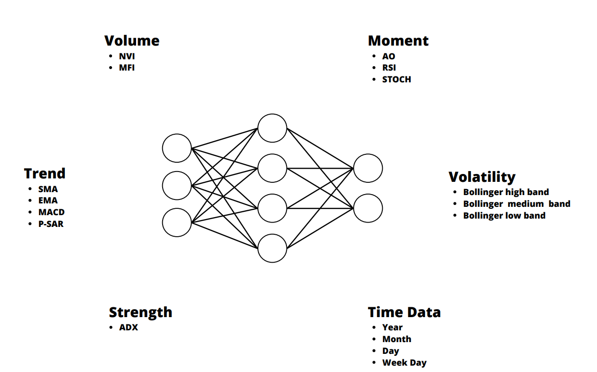
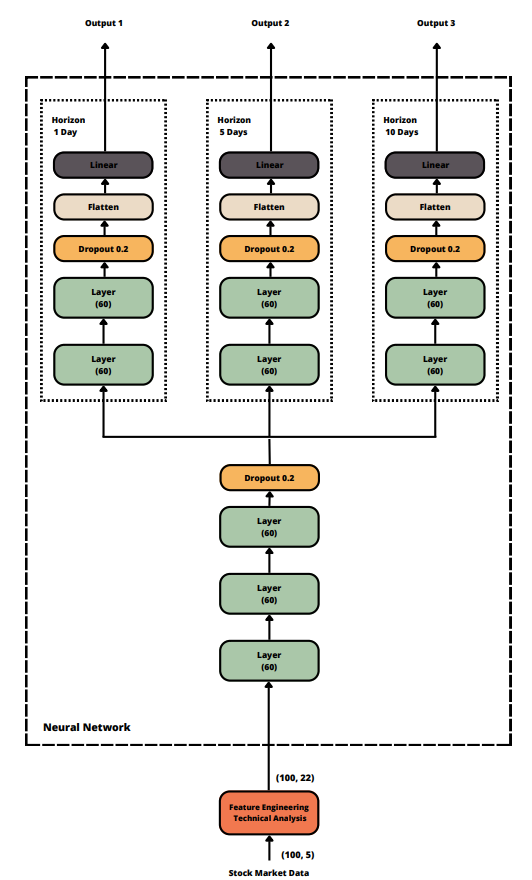

# Study of the Use of Quantum Computers to Calculate Kernel Functions for Machine Learning Applications
Bachelor's Thesis of José Miguel Nicolás García, student of the Universidad Autonoma de Madrid. 

This thesis has investigated the prediction of stock market behavior by the implementation of various neural network  models and techniques. 

Through feature engineering we have introduced different types of technical indicators that analyze the strength, volume, trend, volatility and moment of the studied prices, providing a improvement on the results obtained.

We have used a three path topology that has allowed us to obtain results for horizons of 1, 5 and 10 days. Using  different types of horizons is useful to have different approaches and it can help for the realization of an investment strategy.

Comparing the different models  we have clearly observed how the LSTM networks have repeatedly stood out above the rest, being practically always the ones that offer the best results.

On the other hand, despite several articles recommend convolutional networks for stock market prediction, they have obtained poor results in our experiments. And although, it has been tried to merge convolutional and recurrent networks to try to get the best of both worlds, the outcome is a intermediate or  worse result, concluding that it is better to simply use a recurrent approach.

During the experimentation, we tested with very different types of datasets to see how this affected the results. We have seen the difference in volatility between stock market companies and cryptocurrencies, making the last one prices much more difficult to predict. 

Another finding of interest is the observation that the smaller the company is, the less clear the predicted trend is. 

In summary, a vast study has been performed on the application of Deep Learning in the field of stock market prediction, implementing and improving models not only from the AI point of view but also being able to unify all this technical knowledge with theoretical knowledge of the financial world.
